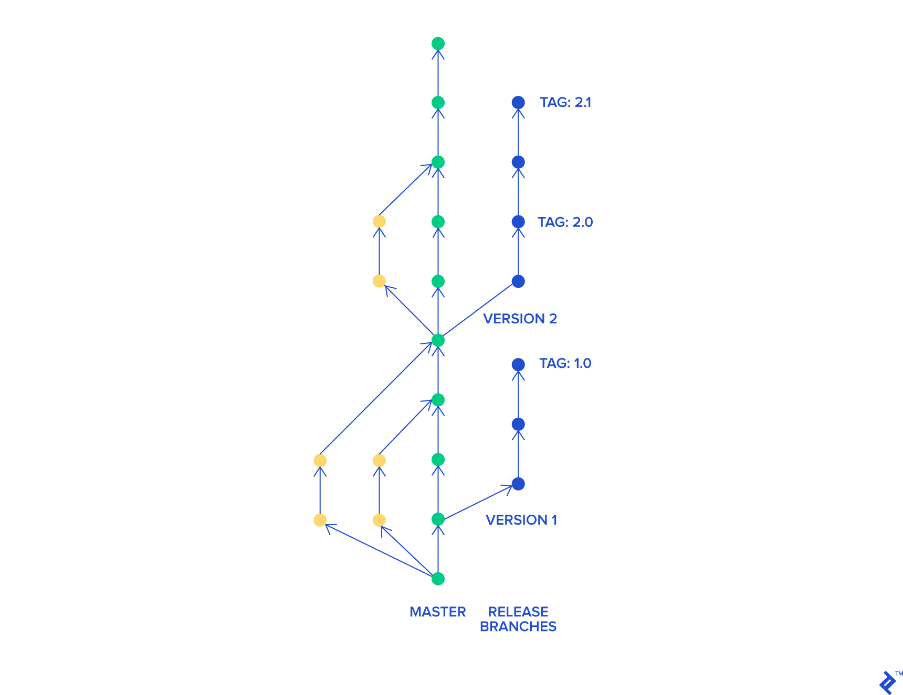

# GitFlows
A little review about Pros and Cons about different workflows with git.

## **Basics:**
### ¿What's the better workflow to use git?
The most important thing is to consider the culture of your team. 
You want the workflow to improve the efficiency of your team, 
not a burden that limits productivity. Here are some questions 
you need to keep in mind when evaluating a Git workflow:

- How well scales this workflow with my team?
- Is it easy to undo mistakes and glitches with this workflow?
- Does this workflow impose cognitive excesses on the team?

### Kind of workflows
* **Centralized Workflow.** 
  This kind of workflow is useful for people migrating from centralized
  version control systems like SVN. In this workflow you have a central
  repository in where you can push your work.
* **Feature Branch Workflow.**
  This is a natural extension from the centralized workflow. The main characteristic
  it's that for every new functionality or feature you have an isolated
  version of your main project, this is called a branch, and with this branch
  you can work without worries about your whole project been broken, instead you
  can only broke your feature branch and undo your work if you fail or push if success.
* **Gitflow Workflow.**
  The most-common flow. This workflow was conceived for supporting
  multiple versions of the same program (for example desktop apps), 
  and it's based on the branch model, but you use the tagging system
  to control the release versions of your software.
* **Fork Workflow.**
  Used to decentralize the repository and/or to contribute in 
  widely-spread projects (for example with people from other countries).
  This workflow it's based in the fork function of git, with this function
  you have a clone of the repository that you can modify, but it's not bounded 
  to the original repository, and it's useful when you want to modify 
  the software, but you don't have permissions on the original one.
  

## **Production-ready Flows:**
* **Git Flow**
  .svg)
  When it fits best?
  
* **Github Flow**
  
  
  
  
  
  
* **Master-only Flow**
  
* **Git release Flow**
  
* **GitLab Flow**
  
* **Trunk-based development**
  f
  
