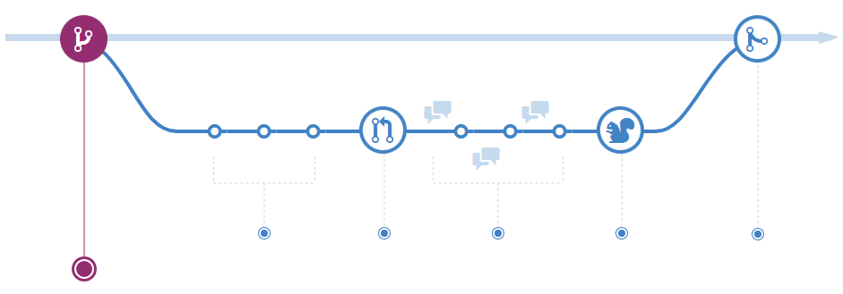

# GitFlows
A little review about Pros and Cons about different workflows with git.

## **Basics:**
### ¿What's the better workflow to use git?
The most important thing is to consider the culture of your team. 
You want the workflow to improve the efficiency of your team, 
not a burden that limits productivity. Here are some questions 
you need to keep in mind when evaluating a Git workflow:

- How well scales this workflow with my team?
- Is it easy to undo mistakes and glitches with this workflow?
- Does this workflow impose cognitive excesses on the team?

### Kind of workflows
* **Centralized Workflow.** 
  This kind of workflow is useful for people migrating from centralized
  version control systems like SVN. In this workflow you have a central
  repository in where you can push your work.
* **Feature Branch Workflow.**
  This is a natural extension from the centralized workflow. The main characteristic
  it's that for every new functionality or feature you have an isolated
  version of your main project, this is called a branch, and with this branch
  you can work without worries about your whole project been broken, instead you
  can only broke your feature branch and undo your work if you fail or push if success.
* **Gitflow Workflow.**
  The most-common flow. This workflow was conceived for supporting
  multiple versions of the same program (for example desktop apps), 
  and it's based on the branch model, but you use the tagging system
  to control the release versions of your software.
* **Fork Workflow.**
  Used to decentralize the repository and/or to contribute in 
  widely-spread projects (for example with people from other countries).
  This workflow it's based in the fork function of git, with this function
  you have a clone of the repository that you can modify, but it's not bounded 
  to the original repository, and it's useful when you want to modify 
  the software, but you don't have permissions on the original one.
  

## **Production-ready Flows:**
* **Git Flow**
  .svg)
  _Original Gitflow:_ 
  - One branch for every new Feature to be introduced in the 
  software.
  - The changes are committed to Develop branch.
  - Bug fixed in Develop branch.
  - Severe bugs work with a Hotfix branch.
  - **Production-ready** software it's incorporated in Release branch.
  - **NOT friendly with Continuous Delivery**.
  - Lack of consistency compared with other flows 
    (Production code it's not Master code).
  - Lack of confidence in Deployment and test suites (different environments 
    for different branches).
  
  _Notes for a modern Gitflow:_
  The original author (Vincent Driessen) has posted an
  actualization note about gitflow because it was conceived
  in 2010, the kind of software it's supposed to support 
  this flow was not the same as our modern software; you can
  see this note in [A successful Git branching model](https://nvie.com/posts/a-successful-git-branching-model/).

* **Github Flow**
  
  Branches are for testing ideas and experiment features,
  when you need these ideas in Master you need your code to 
  be reviewed before merging.
  
  Commit your new ideas to your new branch like in any
  other branch.
  
  Pull Requests initiate discussions about your commits. 
  Because they're tightly integrated with the underlying 
  Git repository, anyone can see exactly what changes would 
  be merged if they accept your request.
  
  By using GitHub's _@mention_ system in your Pull Request 
  message, you can ask for feedback from specific people or teams
  
  Once a discussion has been opened, the person or team reviewing 
  your changes may have questions or comments. Perhaps the coding 
  style doesn't match project guidelines, the change is missing 
  unit tests, or maybe everything looks great and props are in order.
  
  Deploy directly from your new branch, so you can figure out if
  all it's in order before you merge into Master.
  
  Now that your changes have been verified in production, it is time to merge 
  your code into the main branch.
  - **Fast Deploy(Continuous Delivery friendly)**.
  - **Fastest Rollback**.
  - Only one feature at a time deployed.
* **Master-only Flow**
  
  - AKA Single-branch
  - Only work with Master branch.
  - Force the commit directly to Master.
  - Good quality code committed.
  - Needs a good test suite.
  - Needs good communication, cohesion and a very mature development team.
  - Good for embracing pair-programming.
* **Git release Flow**
  
  - Topic branches:
    Mini-features developed (very specific and concrete functionality, 
    minimal work units).
  - Milestones:
    Every 3 weeks (for example), when the _sprint_ has finished all the topic 
    branches from that period are integrated into the release.
  - Thought for working with a lot of pull-request rate (**large teams**).
  - A lot of features deployed in every sprint (a lot of things can fail).
* **GitLab Flow**
  
  - Master is used for staging changes.
  - One branch for every environment (one for production, one for pre-production).
  - Merge changes with **cherry-pick for bugfix**.
  
  - Very secure workflow.
  - Can reduce bugs in production, **more confidence in production deployment**.
  - More complex releases.
  - Good for Continuous Delivery but not best.
  - What you build it's what your test in every environment (immutable build).
* **Trunk-based development**
  
  - Release branches:
    Act as the official repository for a specific version fo your
    software
  - Needs a very good Continuous Integration/Deployment environment.
  - Production deployment from Master and/or Release.
  - Use of tags for identifying software versions.
  - Trusts in a robust test suite. 
  
